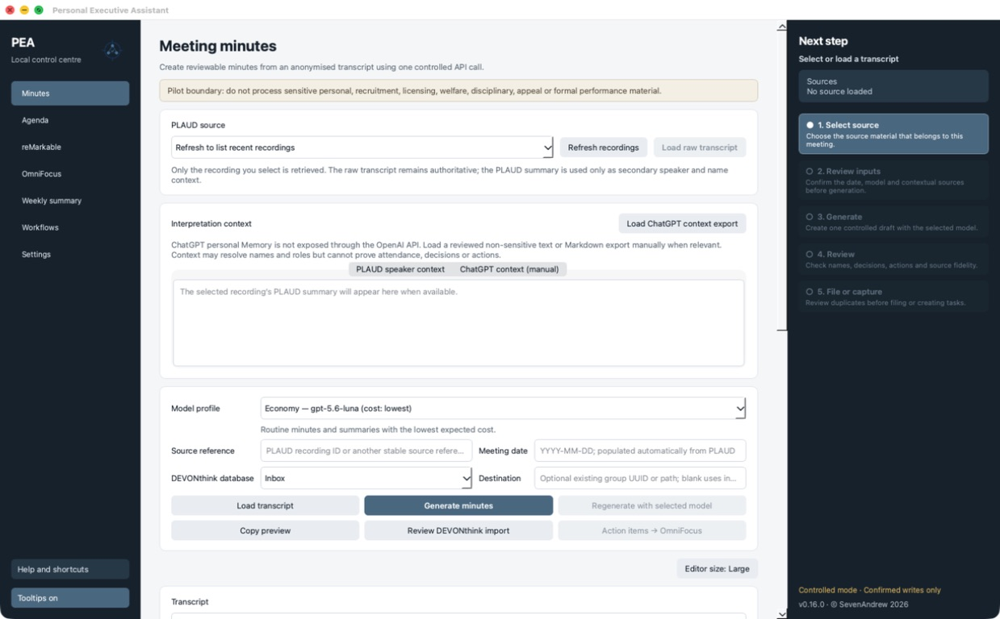

# Personal Executive Assistant

Personal Executive Assistant (PEA) is a local macOS desktop application for turning explicitly
selected work sources into reviewable meeting minutes, daily summaries, weekly summaries and
controlled task captures.



PEA keeps the user in control of every source read and external write. It does not continuously
monitor applications, read mailboxes automatically or act as an unconstrained autonomous agent.

## Main capabilities

- Generate formal British-English meeting minutes from a selected PLAUD transcript.
- Use the corresponding PLAUD summary only as secondary speaker-identification context.
- Load explicitly selected Agenda and already-transcribed reMarkable notes.
- Add work-related chats or exported emails manually to daily and weekly summaries.
- Render generated Markdown before any record is filed.
- Review DEVONthink duplicates before an explicitly confirmed write to the Inbox.
- Read bounded OmniFocus task metadata and prepare controlled Inbox captures.
- Regenerate Minutes or summaries with a different model profile.
- Check local dependencies, authorisations, API usage and bounded runtime diagnostics.

## Privacy and control model

- Source content is loaded only after a user action.
- API requests use `store=false`.
- OpenAI keys are stored in the macOS Keychain or supplied through `OPENAI_API_KEY`.
- OAuth material remains in the relevant connector's private per-user storage.
- Runtime logs exclude keys, source content, prompts and generated documents.
- DEVONthink writes require a source reference, duplicate check and final confirmation.
- The public configuration writes only to the DEVONthink database named `Inbox`.
- The bundled OmniFocus adapter exposes two read-only tools only.

See [SECURITY.md](SECURITY.md) for the detailed boundaries and reporting process.

## Requirements

- Apple-silicon Mac
- macOS 13 or newer
- OpenAI API key for generation features
- Python 3.11 or newer for source installation
- Optional supported applications and connectors for their respective integrations
- Node.js 20 or newer for PLAUD and remarkdown integrations

PEA's first-run assistant checks local dependencies without reading connected-application content.
It presents each supported installation separately and runs it only after the user approves the
exact source, command and destination. Homebrew, API keys, OAuth sign-ins and macOS permissions are
never configured without the user.
The complete content-free System health check then runs automatically at every application start
until every required dependency, authorisation and advertised capability reports **OK**. Closing
the assistant or configuring only the API key does not mark setup as complete.

## Install from source

Install [uv](https://docs.astral.sh/uv/) and run:

```sh
git clone https://github.com/SevenAndrew/personal-executive-assistant-desktop.git
cd personal-executive-assistant-desktop
uv sync --group test
uv run pea-app
```

## macOS preview bundle

The `v0.16.2` pre-release includes an Apple-silicon ZIP bundle for evaluation. It is ad-hoc signed,
not Developer-ID signed or notarised. macOS may therefore prevent it from opening. Do not disable
or bypass macOS security controls; use the source installation if the bundle is not accepted.

No API key, OAuth material, transcript, generated document, application setting or runtime log is
included in the bundle.

## Build the bundle

On an Apple-silicon Mac:

```sh
./scripts/build-macos-app.sh
```

The outputs are `dist/PEA.app` and `dist/PEA-<version>-macos-arm64.zip`.

## Development

```sh
uv sync --group test
uvx ruff check .
uv run pytest -q
```

Contributions should preserve the explicit-read, duplicate-check and confirmed-write boundaries.
See [CONTRIBUTING.md](CONTRIBUTING.md).

## Licensing and trademarks

PEA source code is licensed under the [MIT License](LICENSE). The macOS bundle contains third-party
software under additional licences; see [THIRD_PARTY_NOTICES.md](THIRD_PARTY_NOTICES.md) and the
`LICENSES` directory.

PEA is an independent project. OpenAI, ChatGPT, PLAUD, DEVONthink, OmniFocus, Agenda, reMarkable,
remarkdown, Apple and macOS are trademarks of their respective owners. Their mention does not imply
affiliation or endorsement.
